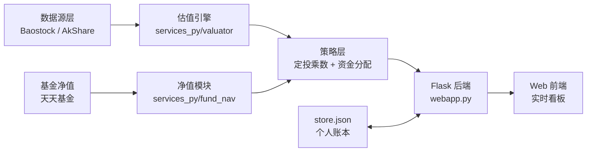

<div align="center">

# 知衡 · Fund DCA Keeper

### 全免费数据源驱动的个人基金长期定投引擎

**自动估值 · 价值投资乘数 · 纪律化定投 · 智能资金分配**

<br>

[](LICENSE)


</div>

---

## 📖 项目定位

> 知衡不是"荐股工具"，也不是"预测神器"——它是一台**纪律执行机器**。

个人投资者长期定投最大的敌人不是市场，是**人性**：高点贪婪加仓、低点恐惧割肉。知衡把巴菲特的"别人恐惧我贪婪"量化成一套**可执行的规则**：自动抓取真实估值数据，告诉你"这个月该投多少、投哪只"，替你守住纪律。

**核心原则：系统只做维护与提醒，不做预测。**

---

## ✨ 核心能力

| 模块 | 能力 | 技术口径 |
|---|---|---|
| 📊 **真实估值引擎** | 宽基/行业指数实时估值 | 乐咕历史 PE 分位 · 巨潮行业 PE · 中证指数 PE |
| 🎯 **价值投资乘数** | 估值驱动定投金额 | 低估 1.5x 加码 / 合理 1.0x / 高位 0.5x / 高估 0.0x 暂停 |
| 💰 **真实净值追踪** | 持仓盈亏实时可视 | 天天基金接口 · 单位净值 · 成本核算 |
| 🏦 **四水池资金管理** | 月度资金科学分配 | 日常开销 / 偿债 / 专项目标 / 定投 |
| 📅 **交易日历引擎** | 自动避开节假日 | 新浪交易日历 · 定位每月首个实际交易日 |

---

## 🏗️ 系统架构



---

## 🔌 数据源（100% 免费）

| 数据 | 来源 | 用途 | 费用 |
|---|---|---|---|
| 个股/指数行情 | **Baostock** | 免费主力数据 | 完全免费，无 token |
| 宽基 PE 分位 | **乐咕乐股** | 沪深300/中证500/上证红利 | 免费 |
| 行业 PE | **巨潮资讯** | 电子/半导体行业估值 | 免费 |
| 基金净值 | **天天基金** | 持仓盈亏 | 免费 |
| 交易日历 | **新浪财经** | 节假日判断 | 免费 |

> 🚫 **零付费、零注册、零 token**。不依赖任何付费 API。

---

## 📐 定投乘数逻辑

```
估值分位  ─────────────────────────────────
  < 30%   →  🟢 低估黄金区    × 1.5  加码买入
 30-70%   →  🟡 估值合理      × 1.0  正常定投
 70-90%   →  🟡 高位防御      × 0.5  减半投入
  > 90%   →  🔴 高估泡沫      × 0.0  暂停定投
```

强周期行业（半导体/芯片）采用**当前 PE 绝对值**而非点位分位，避免"盈利下滑导致 PE 被动拉高"的价值陷阱。

---

## 🚀 快速开始

### 环境要求
- Python 3.10+
- Windows / macOS / Linux

### 安装

```bash
git clone https://github.com/lzlin3459-hash/fund-dca-keeper.git
cd fund-dca-keeper

python -m venv .venv
# Windows
.venv\Scripts\activate
# macOS/Linux
source .venv/bin/activate

pip install flask baostock akshare pandas
```

### 配置账本

```bash
# 复制模板
cp store.example.json store.json
# 编辑 store.json：填入你的基金代码、定投金额、目标
```

### 启动

```bash
python webapp.py
```

浏览器访问 **http://localhost:3000**

> Windows 用户直接双击 `知衡定投系统.bat` 一键启动。

---

## 📁 项目结构

```
fund-dca-keeper/
├── webapp.py                 # Flask 应用入口
├── get_invest_day.py         # 交易日历引擎
├── store.example.json        # 账本模板（脱敏）
├── services_py/
│   ├── valuator.py           # 真实估值引擎
│   ├── fund_nav.py            # 基金净值模块
│   ├── dca_strategy.py        # 价值投资乘数策略
│   └── allocator.py          # 四水池资金分配
├── web/                       # 前端单页应用
└── 知衡定投系统.bat           # Windows 一键启动
```

---

## ⚠️ 免责声明

本项目为**个人投资管理工具**，所有数据来源于公开免费接口，可能存在延迟或误差。

- **不构成任何投资建议**
- 历史数据不代表未来收益
- 基金有风险，投资需谨慎
- 使用本工具产生的任何投资决策与盈亏，由使用者自行承担

---

<div align="center">

**MIT License © 2026 lzlin3459-hash**

</div>
